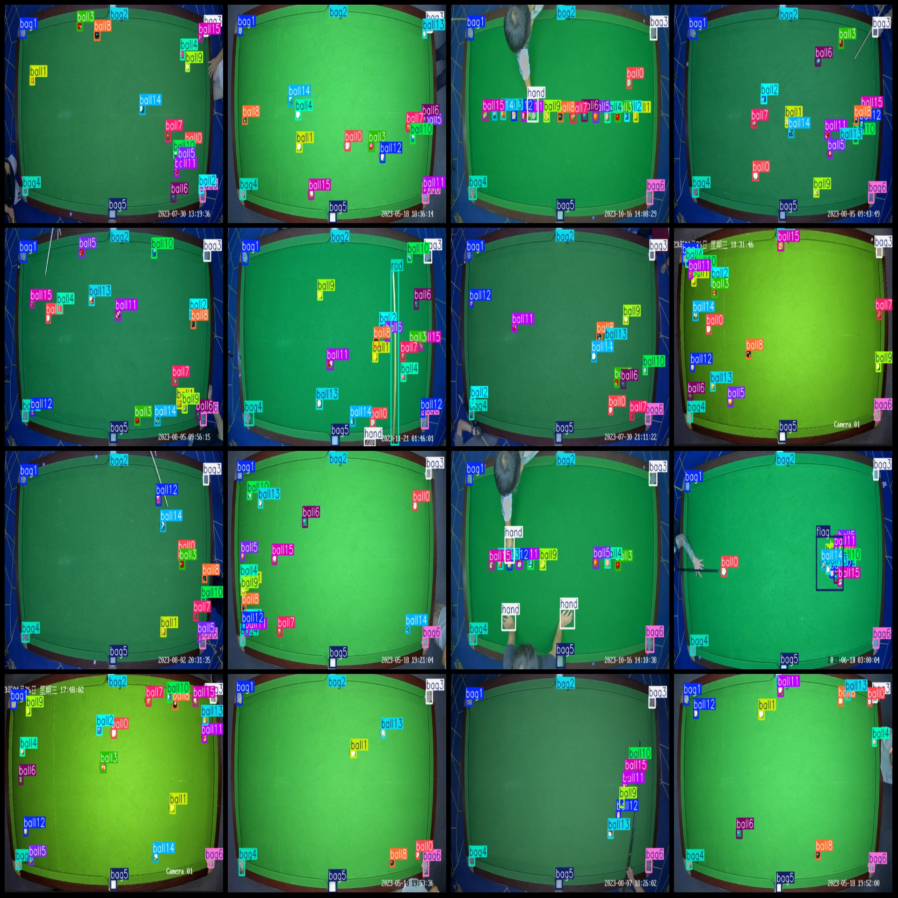
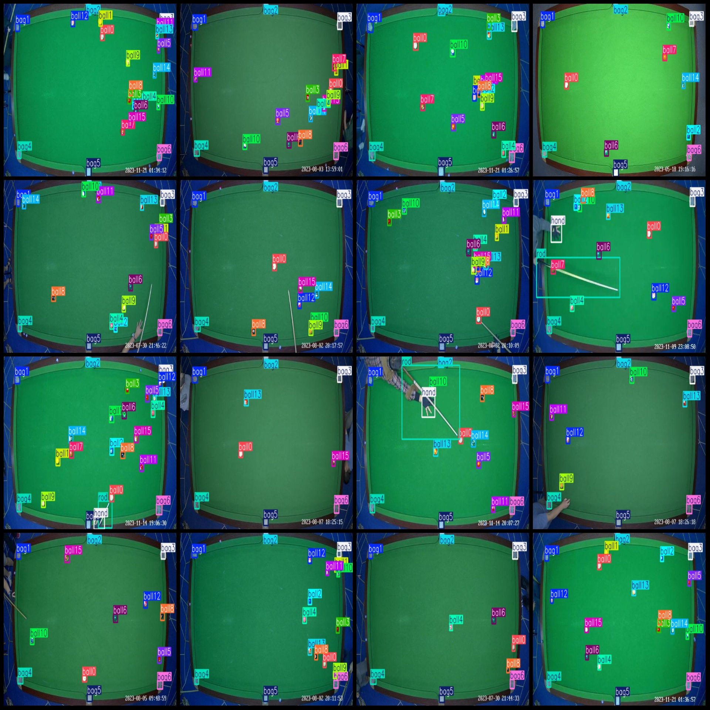

# Table Tennis Detection Dataset VOC+YOLO format 2109 images with 25 classes

The dataset format is Pascal VOC format+YOLO format (without split paths in txtfile, only containing jpgimages and corresponding VOC format xmlfile and yolo format txtfile).
number of images: 2109  
Number of annotated XML files: 2109
The number of txt files is 2109.
The number of labeled categories: 25
The class names for the annotation classes are: ["bag1", "bag2", "bag3", "bag4", "bag5", "bag6", "ball0", "ball1", "ball2", "ball3", "ball4", "ball5", "ball6", "ball7", "ball8", "ball9", "ball10", "ball11"].
"ball12","ball13","ball14","ball15","flag","hand","rod"]  
boxes per class:   
bag1 box count = 2028  
bag2 box count = 2026  
bag3 box count = 2041  
bag4 box count = 2031  
bag5 box count = 1977  
bag6 box count = 2037  
ball0 box count = 1770  
ball1 box count = 1281  
ball2 box count = 1325  
ball3 box count = 1402  
ball4 box count = 1421  
ball5 box count = 1435  
ball6 box count = 1297  
ball7 box count = 1130  
ball8 box count = 1561  
ball9 box count = 1387  
ball10 box count = 1515  
ball11 box count = 1305  
ball12 box count = 1412  
ball13 box count = 1418  
ball14 box count = 1095  
ball15 box count = 1334  
flag box count = 85  
hand box count = 919  
rod box count = 314  
total boxes: 35546  
images per class:   
bag1 images = 2027  
bag2 images = 2024  
bag3 images = 2038  
bag4 images = 2026  
bag5 images = 1975  
bag6 images = 2034  
ball0 images = 1769  
ball1 images = 1281  
ball2 images = 1325  
ball3 images = 1402  
ball4 images = 1420  
ball5 images = 1432  
ball6 images = 1296  
ball7 images = 1127  
ball8 images = 1559  
ball9 images = 1387  
ball10 images = 1514  
ball11 images = 1305  
ball12 images = 1412  
ball13 images = 1417  
ball14 images = 1093  
ball15 images = 1334  
flag images = 85  
hand images = 610  
rod images = 310  
image resolution: 640x360
## Images

Here is a pay link on Stripe ( https://buy.stripe.com/3cs8yP7sY87d0vu9AB ). Please contact me lonlonago@foxmail.com after funding $89, and I will send you a complete data files , thank you!

